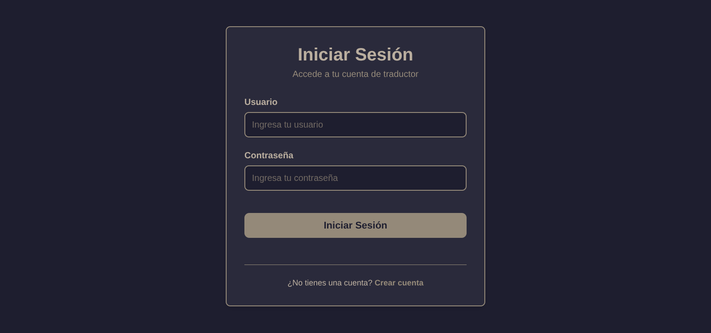
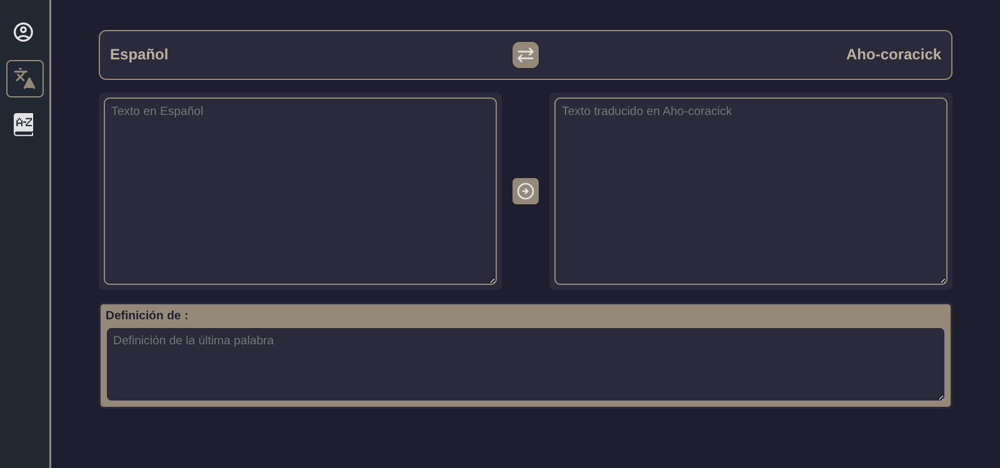
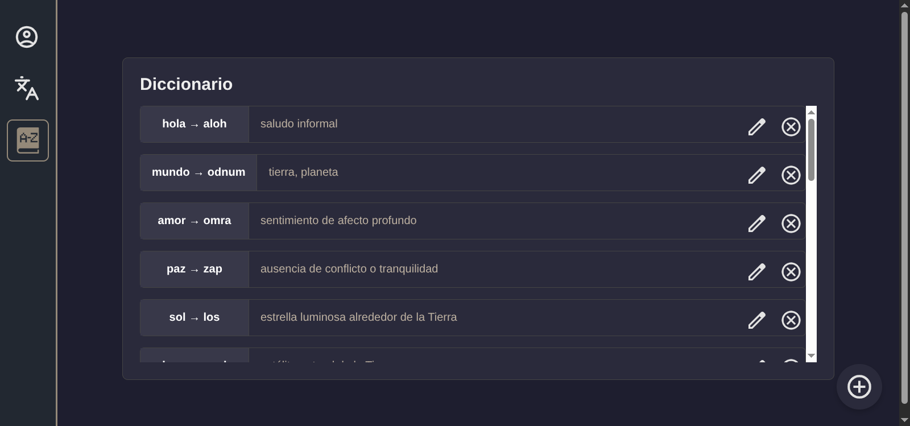
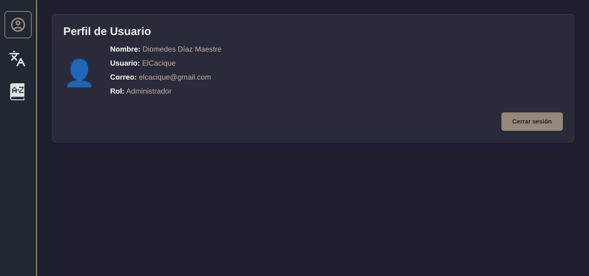

# Traductor Español - Aho-Corasick

Este proyecto es una entrega de la materia **Desarrollo Web 1** de la Universidad Nacional de Colombia. Su objetivo es implementar una interfaz web funcional para un **traductor de palabras y frases entre el idioma español y un idioma artificial llamado Aho-Corasick**. Todo el desarrollo fue realizado usando únicamente tecnologías web nativas (HTML, CSS y JavaScript), sin el uso de frameworks o librerías externas.

---

## Vista previa




---

## Comenzando

Puedes clonar este repositorio en tu máquina local con el siguiente comando:

```bash
git clone https://github.com/drifterDev/traductor.git
```

O descargar directamente el archivo comprimido desde GitHub.

---

## Ejecución del proyecto

Dado que el proyecto está construido completamente en HTML, CSS y JavaScript puro, no necesita compilación ni instalación de dependencias. Puedes ejecutarlo de dos formas:

### Opción 1: Usando servidor local de Python

Si tienes Python instalado, puedes correr un servidor HTTP local:

```bash
# Desde la raíz del proyecto:
python -m http.server
```

Luego, abre tu navegador y visita `http://localhost:8000`.

### Opción 2: Usando Live Server (Visual Studio Code)

1. Abre la carpeta del proyecto en VS Code.
2. Instala la extensión **Live Server** si no la tienes.
3. Haz clic derecho sobre `index.html` y selecciona **"Open with Live Server"**.


---

## Construido con

* **HTML** - Estructura base del sitio.
* **CSS** - Estilos personalizados (sin framework).
* **JavaScript** - Lógica del traductor y manejo del DOM.

---


## Autores

Este proyecto fue desarrollado por:

* **Mateo Álvarez Murillo** [drifterDev](https://github.com/drifterDev)
* **Efraín Gómez Ramírez** [EfraGR](https://github.com/EfraGR)
* **Libardo Jose Navarro Pedrozo** [LibardoNavarro](https://github.com/LibardoNavarro)

**Universidad Nacional de Colombia**

Facultad de Minas

Departamento de Ciencias de la Computación y de la Decisión

---

## Más vistas



